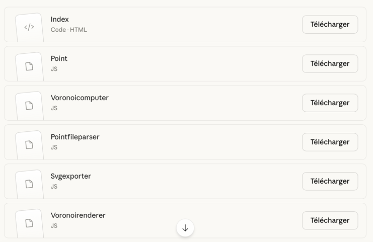
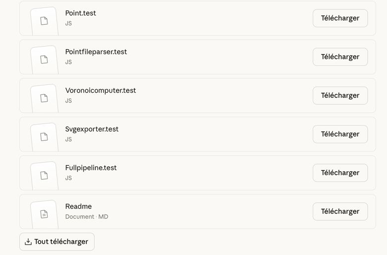
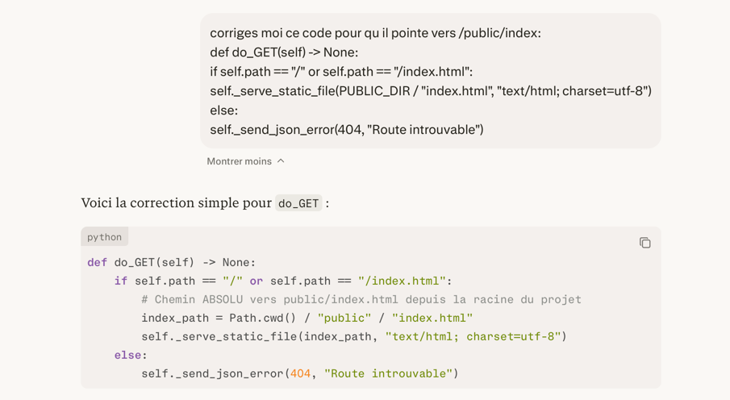

# Voronoï — Générateur de diagrammes (Python)

**Projet BUT Informatique 3ème année**  
Architecture modulaire · TDD · Principes SOLID · `unittest` · Serveur HTTP intégré

---

## Prérequis

- Python 3.10+ (utilise stdlib uniquement — aucune dépendance externe)

---

## Lancer l'application

```bash
# Démarrer le serveur HTTP (port 8765 par défaut)
python main.py

# Ou sur un autre port
python main.py --port 9000
```

Puis ouvrir `http://localhost:8765` dans votre navigateur.

---

## Lancer les tests

```bash
# Tous les tests (61 au total)
python run_tests.py

# Tests unitaires uniquement
python run_tests.py unit

# Tests d'intégration uniquement
python run_tests.py integration

# Mode verbeux
python run_tests.py -v
python run_tests.py unit -v
```

---

## Structure du projet

```
voronoi_python/
├── main.py                          # Point d'entrée CLI
├── run_tests.py                     # Lanceur de tests
│
├── src/
│   ├── core/                        # Domaine métier (zéro dépendance externe)
│   │   ├── point.py                 # Entité Point (dataclass frozen)
│   │   ├── parse_error.py           # Erreur structurée (dataclass frozen)
│   │   ├── bounding_box.py          # Boîte englobante
│   │   ├── voronoi_diagram.py       # VoronoiEdge + VoronoiDiagram
│   │   └── voronoi_computer.py      # Algorithme par grille
│   │
│   ├── io/                          # Entrées/sorties
│   │   ├── point_file_parser.py     # Parseur de fichier texte tolérant
│   │   └── svg_exporter.py          # Export SVG
│   │
│   └── ui/
│       └── http_server.py           # Serveur HTTP + API JSON
│
├── tests/
│   ├── unit/
│   │   ├── test_point.py
│   │   ├── test_parse_error.py
│   │   ├── test_point_file_parser.py
│   │   ├── test_voronoi_computer.py
│   │   └── test_svg_exporter.py
│   └── integration/
│       └── test_full_pipeline.py
│
└── public/
    └── index.html                   # Interface web (se connecte à l'API)
```

---

## Format de fichier accepté

Un fichier texte `.txt` avec une paire de coordonnées par ligne :

```
2,4
5.3,4.5
-10,20.5
0,0
```

**Règles :**
- Séparateur : virgule
- Coordonnées entières ou décimales (point `.`)
- Nombres négatifs acceptés
- Espaces autour des valeurs ignorés
- Lignes vides ignorées
- Lignes invalides signalées avec leur numéro, sans interrompre le traitement

---

## API HTTP

| Méthode | Route | Description |
|---------|-------|-------------|
| `GET` | `/` | Interface web |
| `POST` | `/api/compute` | Calcule le diagramme → JSON |
| `POST` | `/api/export/svg` | Génère le SVG → `image/svg+xml` |

### POST /api/compute

**Corps :**
```json
{ "text": "0,0\n100,0\n50,86" }
```

**Réponse :**
```json
{
  "diagram": {
    "sites": [{"x": 0, "y": 0}, ...],
    "edges": [{"x1": ..., "y1": ..., "x2": ..., "y2": ..., "left": 0, "right": 1}, ...],
    "boundingBox": {"minX": -60, "maxX": 160, "minY": -60, "maxY": 146}
  },
  "errors": [
    {"lineNumber": 3, "rawContent": "bad line", "reason": "format attendu : x,y"}
  ]
}
```

---

## Principes architecturaux

### SOLID

| Principe | Application |
|----------|-------------|
| **S** Single Responsibility | `point_file_parser.py` parse uniquement · `voronoi_computer.py` calcule uniquement · `svg_exporter.py` exporte uniquement · `http_server.py` orchestre les requêtes |
| **O** Open/Closed | Nouveaux formats d'export (PDF, PNG pur Python) ajoutables sans modifier l'existant |
| **L** Liskov | `ParseError(Exception)` respecte l'interface d'`Exception` |
| **I** Interface Segregation | Chaque module n'importe que ce dont il a besoin |
| **D** Dependency Inversion | `http_server.py` dépend des interfaces publiques, pas des détails |

### Faible couplage — Forte cohésion

```
core/     ← aucune dépendance interne
io/       ← dépend de core/ uniquement
ui/       ← dépend de core/ et io/ uniquement
tests/    ← dépend des interfaces publiques uniquement
```

### Immutabilité

`Point`, `ParseError`, `BoundingBox`, `VoronoiEdge`, `VoronoiDiagram` sont tous des `dataclass(frozen=True)` : thread-safe, prévisibles, sans effets de bord.

### TDD (Red → Green → Refactor)

Ordre d'écriture des tests :
1. `test_point.py` → `point.py`
2. `test_parse_error.py` → `parse_error.py`
3. `test_point_file_parser.py` → `point_file_parser.py`
4. `test_voronoi_computer.py` → `voronoi_computer.py`
5. `test_svg_exporter.py` → `svg_exporter.py`
6. `test_full_pipeline.py` → validation end-to-end

---

## Algorithme

Approximation par **grille 600×600** :

1. Calculer la `BoundingBox` de tous les sites (+ padding de 60 unités)
2. Pour chaque pixel de la grille, identifier le site le plus proche (distance euclidéenne au carré pour éviter `sqrt`)
3. Détecter les frontières entre régions adjacentes → liste de `VoronoiEdge`
4. Mapper les coordonnées monde → coordonnées SVG/canvas

**Complexité :** O(n × R²) où n = nombre de sites, R = 600  
**Avantage :** stdlib uniquement, aucune dépendance, déterministe  
**Pour aller plus loin :** implémenter l'algorithme de Fortune O(n log n) avec un arbre de Beachline

---

## Lien pour le prompt ClaudeAI

https://claude.ai/share/a4640f73-a586-4002-add1-b36a5972b4aa

Les fichiers crées n'apparaissent pas avec ce lien... Voici une copie des fichiers délivrés par l'IA :




Ces fichiers étaient faits en JavaScript. Puis avec le deuxième prompt pour corriger cela et avoir une version en Python, les fichiers retournés sont ceux de l'application finale.

---

## Journal des corrections

En termes de correction, il n'y avait qu'un seul problème. Au moment de taper l'URL du localhost, un message d'erreur disait que le fichier index.hml n'était pas trouvé.
Ainsi, un problème de chemin a été détecté. N'ayant plus de crédit sur l'IA Claude, le fichier index.html a été donné à Perplexity pour qu'il corrige ce problème. Voici le prompt et le résultat :



De ce fait, la correction de problème m'a pris environ 5 minutes. Si l'on compte le temps total passé pour faire cette application, alors j'estime ce temps à environ 30 minutes, ClaudeAI ayant été assez long pour générer les fichiers (qui étaient assez nombreux) et en comptant aussi le temps de mettre en place l'architecture qu'il proposait et de tester l'application.